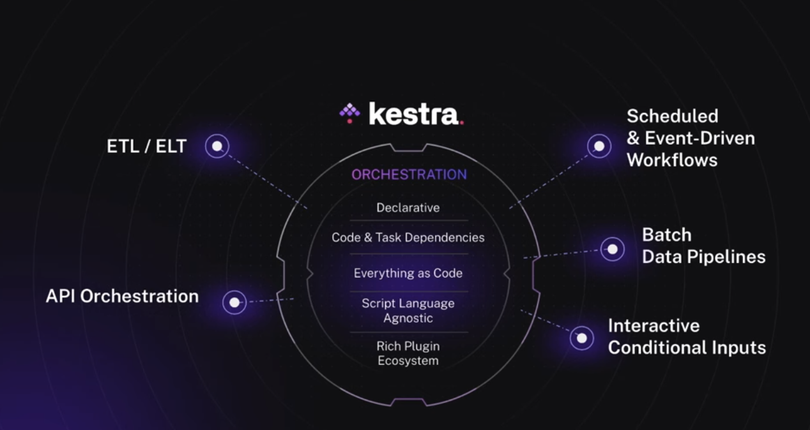
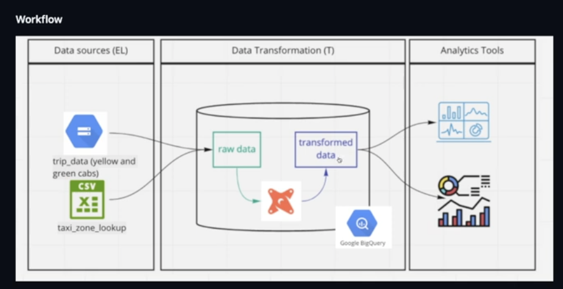

# Data Orchestration


<br>

## NOTES 📝

- [All the flows](https://github.com/DataTalksClub/data-engineering-zoomcamp/tree/main/02-workflow-orchestration/flows)
- Run `docker-compose up --build` in the main container for Kestra; Then go to db folder and run it again for db + pgadmin

## Kestra

Kestra is a modern and scalable workflow orchestrator that allows you to define and run workflows with ease. It is built to be simple to use, yet scalable and performant. Kestra is fully open-source and can be used on-premise or in the cloud.

- [Beginner Tutorial List](https://www.youtube.com/watch?v=HR47SY2RkPQ&list=PLEK3H8YwZn1oaSNybGnIfO03KC_jQVChL&ab_channel=Kestra)

- [Kestra with Docker](https://www.youtube.com/watch?v=SGL8ywf3OJQ&ab_channel=Kestra)

### Flows

Flows are workflows.
Declared in yaml. 

- **id:** name of your flow
- **namespace:** environment of your flow
- **tasks:** what you want to do

### Extra concepts

- **Inputs**: Act like constant variables
````
inputs:
    - id: variable_name
    type: STRING
    defaults: example_string
````
- **Outputs:** Can be reused
- **Triggers:** Flows are executed by triggers

## DBT
