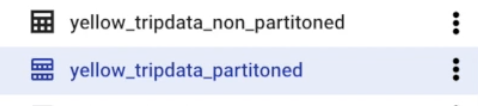

# Data Warehouse and BigQuery

1. [OLTP x OLAP x Data Warehouse](#oltp-x-olap-x-data-warehouse)
   - [In Summary](#in-summary)
   - [Data Flow](#data-flow)
   - [Purpose and Use](#purpose-and-use)
   - [Schema Design](#schema-design)
   - [OLTP (Online Transaction Processing)](#oltp-online-transaction-processing)
   - [OLAP (Online Analytical Processing)](#olap-online-analytical-processing)
   - [Data Warehouse](#data-warehouse)

2. [Partitioning vs Clustering](#partioning-vs-clustering)
   - [Partitioning](#partition)
   - [Clustering](#clustering)

3. [BigQuery](#bigquery)
   - [Best Practices](#best-practices)
     - [Cost Reduction](#cost-reduction)
     - [Improve Query Performance](#improve-query-performance)


## 1. OLTP x OLAP x Data Warehouse
**In Summary:**
- OLTP is like a cashier recording every sale in a store.
- Data Warehouse is like the store manager's database that combines all sales records from multiple branches for a full overview.
- OLAP is like an analyst reviewing and slicing these sales data to uncover patterns, trends, and insights for decision-making.

-------------


**Data Flow:**
- Data originates in OLTP systems, where business transactions are recorded. 
- This raw transactional data is extracted, transformed, and loaded (ETL/ELT process) into the Data Warehouse.


**Purpose and Use:**
- OLTP focuses on operational efficiency and quick transactional processes.
- Data Warehouse stores historical, cleaned, and consolidated data for analytical purposes.
- OLAP provides tools and technologies to analyze the data in the Data Warehouse, supporting business intelligence and strategic decisions.


**Schema Design:**
- OLTP systems use normalized schemas to reduce redundancy and improve transactional performance.
- Data Warehouses use denormalized schemas (e.g., star schema) to optimize analytical queries.

------


| Feature                 | OLTP                          | OLAP                         |
|-------------------------|-------------------------------|------------------------------|
| **Main Use**            | Day-to-day operations         | Data analysis and reporting  |
| **Data Volume**         | Small and current             | Large and historical         |
| **Query Type**          | Simple, fast transactions     | Complex, analytical queries  |
| **Data Structure**      | Normalized                    | Denormalized                 |
| **Users**               | Operational staff/customers   | Analysts/decision-makers     |
| **Backup and recovery**| Regular backups required to ensure business continuity and meet legal and governance requirements | Lost data can be reloaded from OLTP database as needed in lieu of regular backups |
| **Space requirements** | Generally small if historical data is archived                        | Generally large due to aggregating large datasets                        |


### **OLTP (Online Transaction Processing)**
Designed to handle day-to-day operations like sales, banking transactions, or customer orders.

- Fast and frequent transactions: Handles many small, quick tasks like adding a new order or updating an account balance.
- Real-time updates: Ensures data is always up-to-date for operational needs.
- Data structure: Highly normalized (organized into many tables to avoid redundancy).
- Users: Typically used by front-line employees or customers interacting with systems like apps or websites.
- Example: When you buy something online, OLTP systems handle the order, update the stock, and process the payment—all quickly and accurately.

### **OLAP (Online Analytical Processing)**
Designed for analyzing large amounts of data to identify trends, patterns, or insights.

- Complex queries: Processes heavy, analytical queries like "What were our total sales by region over the past year?"
- Historical data: Often works with aggregated data to look at trends over time.
- Data structure: Denormalized for faster reading (data may be stored in fewer, broader tables).
- Users: Typically used by analysts, decision-makers, or business intelligence tools.
- Example: A company might use OLAP to analyze last year's sales to decide which products to promote this year.

### **Data Warehouse**
Central repository that aggregates, organizes, and stores historical data for analysis.


- Role in the ecosystem: Pulls and integrates data from multiple OLTP systems (and other sources like APIs, logs, or flat files).
- Uses ETL/ELT processes to transform transactional data into a structured format suitable for analysis.
- Serves as the foundation for OLAP activities.
- Optimized for read-heavy operations and large-scale aggregations.
- Stores denormalized data in formats like star or snowflake schemas for performance and usability.


-----------


## 2. Partioning vs Clustering

| **Feature**       | **Partitioning**                                 | **Clustering**                                    |
|--------------------|--------------------------------------------------|--------------------------------------------------|
| **Granularity**    | Divides the table into independent partitions.   | Organizes data within the table (or partition).  |
| **Key Columns**    | Focuses on one partitioning column (or criteria).| Focuses on one or more clustering columns.       |
| **Storage**        | Creates separate physical storage for partitions.| No separate storage; organizes data internally.  |
| **Use Case**       | Filters on partitioning column (e.g., date).     | Filters or aggregates on clustering columns.     |
| **Benefit**        | Reduces query cost by skipping entire partitions.| Reduces data scanned within partitions or table. |


### **Partition**
Partitioning divides a table into smaller, manageable segments (called partitions) based on the values in one or more columns. It allows queries to scan only relevant partitions, improving performance for queries that filter on the partitioned column(s).


- The icone for partitioned and non-partitioned data is different (the one for partitioned has a little bar)


### **Clustering**
Clustering organizes data within a table (or partition) based on the values in one or more columns. It stores similar rows together physically, reducing the amount of data scanned during queries.


- The order of the columns matter for performance
- Clustering improves filter and aggrehgate queries
- You can specify up to for
- Useful for big tables (> 1GB)

---------------

## 3. BigQuery
- Serverless datawarehouse
- Software as well as infrastructure including scalability and high-availability 
- Uses column oriented structured


- You can used BigQuery to run ML models

````
CREATE OR REPLACE EXTERNAL TABLE `taxi-rides-ny.nytaxi.external_yellow_tripdata``
OPTIONS(
    format = 'CSV',
    -- you can get all files stored in the bucket with *
    uris=['gs://nyc-tl-data/tripdata/yellow_tripdata_2019-*.csv'] 
)
````

### **Best practices**
**COST REDUCTION**
- Avoid `SELECT *` 
- Price queries before running them
- Use clustered or partioned tables

**IMPROVE QUERY PERFORMANCE**
- Filter on partitioned columns
- Denormalise data
- Use nested or repeated columns
- Reduce data before using `JOIN`
- Place the table with the largest number of rows first followed by the tables with the fewest rows, and then place the remaning tables by decreasing size.
