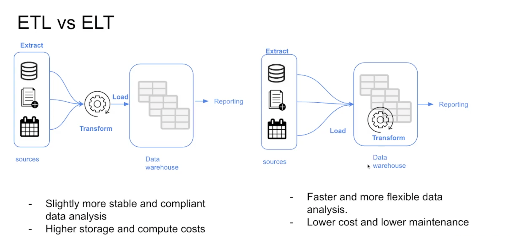
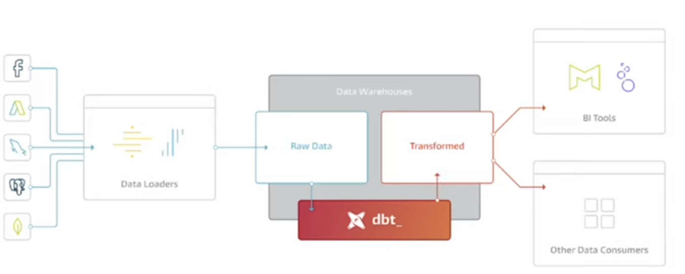

# Analytics Engineering

## Roles
*Data Engineer* Prepares and maintain the infrastructure the data team needs
*Analytics Engineer* Introduces the good software engineering practices to the efforts of data analysts and data scientist
*Data Analyst* Uses data to solve problems

## Tools

Data Loading >> Data Storing >> Data Modelling >> Data Presentation

*Examples of tools*

**Data Storing:** Snowflake, Bigquery, Redshift
**Data Modeling**: dbt, Dataform
**Data Presentation**: BI tools like Google Data Studio, Looker, Mode, Tableau

## Basics of Analytics Engineering

### REVIEW ETL vs ELT



### Elements of Dimensional Modeling

**FACTS TABLES**
- Measurements, metrics or facts
- Corresponds to a business process (*think of it like verbs / WHAT)*

**DIMENSIONS TABLES**
- Corresponds to a business entity
- Creates context to a business process (*think of it like nouns / WHO*)

### Architecture of Dimensional Modeling
**STAGE AREA** Contains the raw data, not available to everyone
**PROCESSING DATA** From raw data to data models, ensuring standards (*the kitchen of a restaurant, for the cook*)
**PRESENTATION AREA** Final presentation of the data, exposure to stakeholders (*dining room of restaurant)

------

# DBT (Data Build Tool)
Transformation work



Think of **dbt** as a **translator** for your data. It helps transform raw data into clean, organized, and useful data using **SQL**.

✅ **Simplifies data transformation**  
✅ **Encourages best practices (modularity, testing, documentation)**  
✅ **Automates data workflows**  

## How it Works
1. **Raw Data → Clean Data**  
   - You start with messy data in a **data warehouse**.  
   - dbt helps you **clean**, **filter**, and **transform** it into meaningful tables.

2. **SQL-Based**  
   - dbt **only** works with SQL.  
   - You write SQL queries, and dbt **automates** the execution.

3. **Version Control & Documentation**  
   - It tracks changes (like Git) and automatically **documents** your transformations.

4. **Modular & Reusable**  
   - Instead of writing long SQL queries, you can create **reusable models**.

5. **Works with Data Warehouses**  
   - dbt works with **BigQuery, Snowflake, Redshift, and others**.

## **Example: dbt Transformation**

**Scenario:**  
You have a **raw table** called `raw_orders`, which contains messy order data. You want to clean it and create a new table with meaningful data.  

---

**1️⃣ Raw Data (`raw_orders` Table)**
| order_id | customer_id | order_date          | amount  | status  |
|----------|------------|---------------------|---------|---------|
| 101      | A123       | 2024-01-01 10:30:00 | 50.00   | completed |
| 102      | B456       | 2024-01-02 12:15:00 | 75.50   | pending   |
| 103      | C789       | NULL                | 20.00   | completed |
| 104      | A123       | 2024-01-05 15:45:00 | NULL    | completed |

---

**2️⃣ dbt Model (Transformation)**
In **dbt**, you write a SQL transformation query inside a model file (`models/orders.sql`):  

```sql
WITH cleaned_orders AS (
    SELECT
        order_id,
        customer_id,
        -- Ensure order_date is not NULL, replace with default value
        COALESCE(order_date, TIMESTAMP '1970-01-01') AS order_date,
        -- Ensure amount is not NULL, replace with 0
        COALESCE(amount, 0) AS amount,
        -- Convert status to lowercase
        LOWER(status) AS status
    FROM raw_orders
)
SELECT * FROM cleaned_orders;
```

---

**3️⃣ Final Cleaned Table (`cleaned_orders`)**

| order_id | customer_id | order_date          | amount  | status    |
|----------|------------|---------------------|---------|-----------|
| 101      | A123       | 2024-01-01 10:30:00 | 50.00   | completed |
| 102      | B456       | 2024-01-02 12:15:00 | 75.50   | pending   |
| 103      | C789       | 1970-01-01 00:00:00 | 20.00   | completed |
| 104      | A123       | 2024-01-05 15:45:00 | 0.00    | completed |

---

**How dbt Helps**

✅ **Data Cleaning** → Handles `NULL` values using `COALESCE()`  
✅ **Standardization** → Ensures all statuses are **lowercase**  
✅ **Automation** → Runs this transformation every time new raw data comes in  


