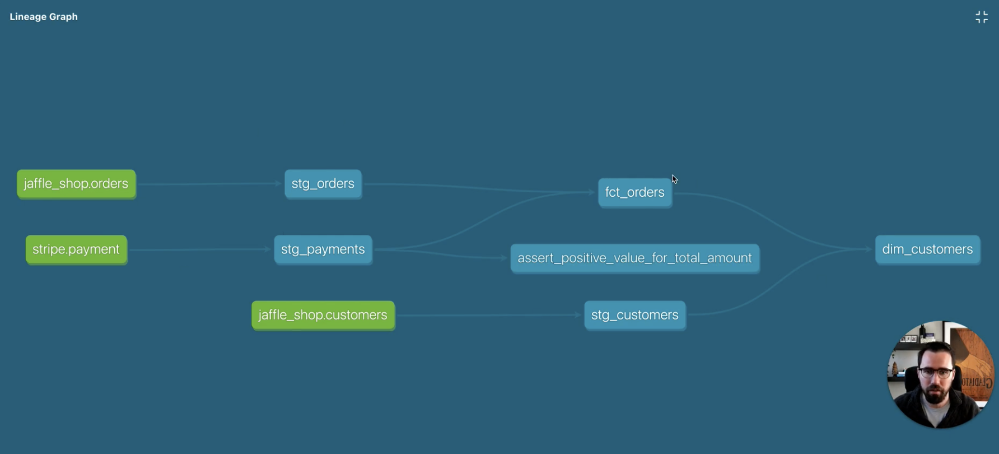

# DBT Fundamentals

## Vocabulary

- **DAG:** Directed Acyclic Graph. A DAG is just a **way to organize tasks (like cooking or transforming data) so that they happen in the right order**, without any repeating steps. It's like a flowchart for your data.

## Overview of a project

green node: came from a data  (connect to stage nodes directly)
blue node: you create in DBT (core)

### dbt Project Structure Summary

#### 1. Staging Models (`/staging/`)

* **Purpose:**
    * Transform raw data sources into a usable format.
    * Initial cleaning and standardization.
* **Characteristics:**
    * Minimal transformations (renaming, casting, filtering).
    * Directly reflect source table structure.
    * First step in the transformation pipeline.
* **Example:**
    * `stg_green_tripdata.sql`
    * `stg_yellow_tripdata.sql`
* **Location in Lineage Graph:**
    * Directly connected to raw data sources.

#### 2. Core Models (`/core/`)

* **Purpose:**
    * Implement core business logic.
    * Create dimension and fact tables.
* **Characteristics:**
    * Complex transformations (joins, aggregations, calculations).
    * Represent key business entities and relationships.
    * Used for analytics.
* **Example:**
    * `dim_customers.sql`
    * `fct_orders.sql`
    * `dim_taxi_trips.sql`
    * `fct_taxi_monthly_zone_revenue.sql`
* **Location in Lineage Graph:**
    * Downstream from staging models.
    * Often involve joins and aggregations.

#### 3. Seed Files (`/seeds/`)

* **Purpose:**
    * Load static data (lookup tables, mappings) into the data warehouse.
* **Characteristics:**
    * Data stored in `.csv` files.
    * Materialized as tables.
    * Used for dimension tables or reference data.
* **Example:**
    * `taxi_zone_lookup.csv`
* **Location in Lineage Graph:**
    * Starting point for dimension models.
    * Independent of raw data sources.

-----

## Simple commands

`dbt run` from left to right, it build the (staged) models

`dbt test` tests the models while they are being built

`dbd docs generate` generates docs, locally or on cloud

`dbt build --select +fact_trips.sql+ --vars '{is_test_run: false}'` command with a variable that be manipulated

----

## dbt run vs. dbt build

* **`dbt run`:**
    * Executes SQL models to create or replace tables/views.
    * Focuses solely on model materialization.
    * Use for transforming data via models.
* **`dbt build`:**
    * A comprehensive command that executes models, seeds, snapshots, and tests.
    * Covers a broader range of dbt operations.
    * Use for complete project execution and CI/CD pipelines.

**Key Differences:**

* `dbt run` is for model execution; `dbt build` is for full project execution.
* `dbt build` includes the functionality of `dbt run` and adds seed loading, snapshotting, and testing.

**In Simple Terms:**

* `dbt run` = "Build my models."
* `dbt build` = "Build and test everything."

---

## Building Up to a Specific Node in dbt (run or build)

**Key Points:**

* Use `+` prefix to include upstream dependencies.
* Use `+` suffix to include immediate downstream dependencies.
* Use `--exclude` to remove specific nodes.
* These selection principles apply to both dbt run, and dbt build.

**Build with Dependencies:**
    * `dbt build --select +model.node_name` (or `dbt run`)
    * Builds the specified node and all its upstream dependencies.
    * Example: `dbt build --select +model.fct_taxi_monthly_zone_revenue`

**Build Only the Node:**
    * `dbt build --select model.node_name` (or `dbt run`)
    * Builds only the specified node, excluding dependencies.
    * Example: `dbt build --select model.fct_taxi_monthly_zone_revenue`

**Build Node and Immediate Children:**
    * `dbt build --select model.node_name+` (or `dbt run`)
    * Builds the specified node and its direct downstream dependencies.
    * Example: `dbt build --select model.dim_taxi_trips+`

**Build Nodes in a Directory:**
    * `dbt build --select models/directory_name` (or `dbt run`)
    * Builds all nodes in the specified directory.
    * Example: `dbt build --select models/staging`
    * `dbt build --select models/directory_name/+` (or `dbt run`)
    * Builds all nodes in the directory and all downstream dependencies.
    * Example: `dbt build --select models/staging/+`

**Exclude Nodes:**
    * `dbt build --select +model.node_name --exclude model.exclude_node` (or `dbt run`)
    * Builds the selected node and its dependencies, excluding the specified node.
    * Example: `dbt build --select +model.fct_taxi_monthly_zone_revenue --exclude model.dim_zone_lookup`

