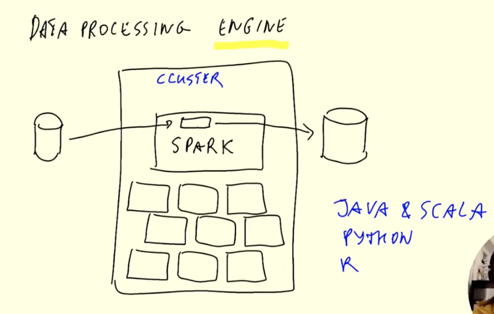

# Batch Processing

Different ways for processing data:

- **BATCH:** Processes big chuncks of data in one go, according to a certain granularity (ie. weekly, hourly, 3 times per hours, etc)
    -- ***Technologies:*** Python scripts, SQL, Spark, Flink, etc.
    -- ***Advantages:*** Easier to scale, manage and retry (when there are errors)
    -- ***Disadvantage:*** Delay of processing, the data is not immediately available

- **STREAMING**

## Apache Spark

Data processing engine, which can use different languages

**When to use Spark?** You have data in a datalake, Spark will pull this data, do some processing, and send the data back to the datalake. When your transformations are too complex that you cannot express them with SQL, you can use Spark. 

**[Environment Setup](01_env_setup.md)** (MacOS Sequoia, brew + anaconda)

