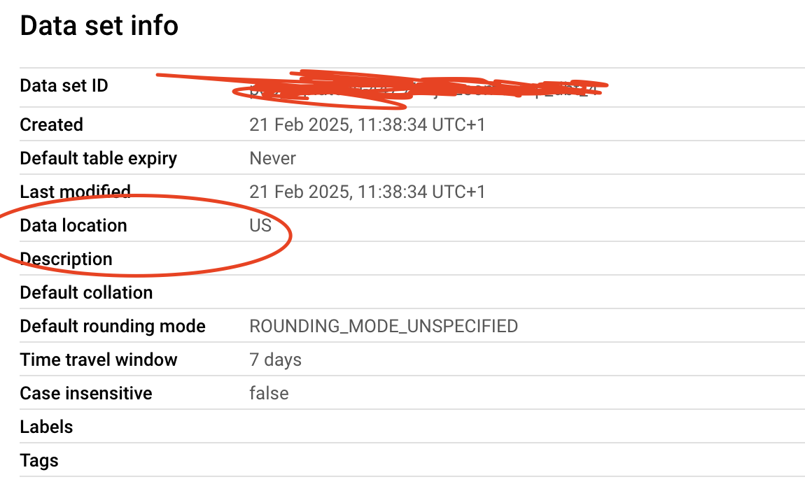
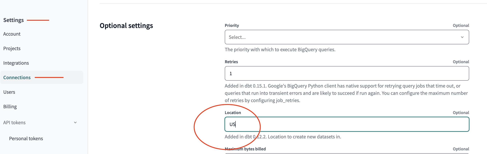

# Homework week 04: DOWNLOADING THE DATASETS & SETTING UP

To be able to download the datasets and setup the environment for the homework for this week, I performed the following steps. I am assuming you have a GCS account, with a bucket setup and the necessary permissions. The steps below will generate a clean environment only with the DS for this week, using dlt for data loading and dbt for further transformation.

-----

1. Started by creating a new database inside my project. I won't do this step manually, as it will be created automatically when I run the scripts below. I am calling my database `zoomcamp_dbt_4`.

2.  Install `pip dlt[bigquery]` if you have not done that yet. As noted in [dlt basics](../../04_1_data_ingestion_dlt/01_dlt_basics.md), use you need to run `pip "dlt[bigquery]" `  if your shell is zhs (with the "").

3. Before running the scripts, make sure you are authenticated in your GCS. 
You can do this via shell with `export GOOGLE_APPLICATION_CREDENTIALS="<YOUR_KEYS.json>"`

4. You might also need to install the following: `pip install google-cloud-bigquery-storage`

5. Run the scripts [`load_green_data.py`](load_green_data.py), [`load_yellow_data.py](load_yellow_data.py),  [`load_fhv_data`](load_fhv_data.py).
These scripts use dlt to download the files to a bucket, and later transform them into schemas in bigquery.

---

**NOTES**:

- I had a couple of issues along the way, from the data types, to a "recursion issue" with dlt. The codes above work around these problems. I believe they have enough comments so you can understand what is happening, as well as enough output to debug the steps.

- **Make sure your tables in bigQuery and your project in dbt are set to the same location!**
If they are not, you will have issues.
I don't think it's possible to change the location of a table after it's created in bigQuery, but you can easily adapt your dbt settings in `Settings >> Connections >> Optional Settings`.

