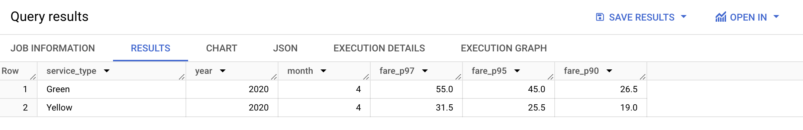
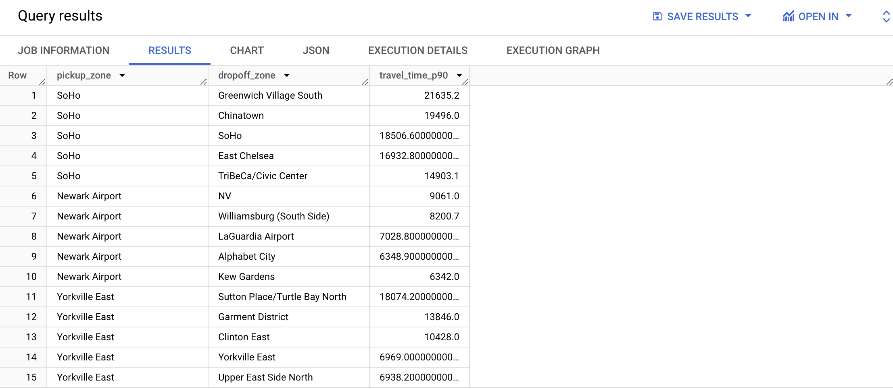

# Homework - Week 04

**NOTE: All the steps performed to download the datasets for this week are described [here](00_env_setup.md)

## Index

- [**01: Understanding dbt model resolution**](#question-1)

- [**02: dbt Variables & Dynamic Models**](#question-2)

- [**03: dbt Data Lineage and Execution**](#question-3)

- [**04: dbt Macros and Jinja**](#question-4)

- [**05: Taxi Quarterly Revenue Growth**](#question-5)

- [**06: Taxi Quarterly Revenue Growth**](#question-6)

- [**07: Top #Nth longest P90 travel time Location for FHV**](#question-7)


-------
<a id="question-1"></a>

**01: Understanding dbt model resolution**
Provided you've got the following sources.yaml

```yaml
version: 2

sources:
  - name: raw_nyc_tripdata
    database: "{{ env_var('DBT_BIGQUERY_PROJECT', 'dtc_zoomcamp_2025') }}"
    schema:   "{{ env_var('DBT_BIGQUERY_SOURCE_DATASET', 'raw_nyc_tripdata') }}"
    tables:
      - name: ext_green_taxi
      - name: ext_yellow_taxi
```

with the following env variables setup where dbt runs:

````
export DBT_BIGQUERY_PROJECT=myproject
export DBT_BIGQUERY_DATASET=my_nyc_tripdata
````

What does this .sql model compile to?
>> select * from myproject.my_nyc_tripdata.ext_green_taxi


*Explanation*:

- From the yaml file: The database is set using the environment variable `DBT_BIGQUERY_PROJECT`, which defaults to `dtc_zoomcamp_2025`.
- From the yaml file: The schema is set using `DBT_BIGQUERY_SOURCE_DATASET`, which defaults to `raw_nyc_tripdata`.
- From the env variables: `DBT_BIGQUERY_PROJECT=myproject`, meaning the database will be `myproject`.
- From the env variables: `DBT_BIGQUERY_DATASET=my_nyc_tripdata` is not used here (it was not set in env variables, the name is slightly different). Instead, the schema should come from `DBT_BIGQUERY_SOURCE_DATASET`, which was not explicitly set in the exports. So, it falls back to the default: `raw_nyc_tripdata`.

---

<a id="question-2"></a>

**02: dbt Variables & Dynamic Models**

Say you have to modify the following dbt_model `(fct_recent_taxi_trips.sql)` to enable Analytics Engineers to dynamically control the date range.

- In development, you want to process only the last 7 days of trips
- In production, you need to process the last 30 days for analytics

````
select *
from {{ ref('fact_taxi_trips') }}
where pickup_datetime >= CURRENT_DATE - INTERVAL '30 days'
````
What would you change to accomplish that in a such way that command line arguments takes precedence over ENV_VARs, which takes precedence over DEFAULT value?

>> Update the WHERE clause to `pickup_datetime >= CURRENT_DATE - INTERVAL '{{ var("days_back", env_var("DAYS_BACK", "30")) }}' DAY`


*Explanation*:

- `var("days_back", ...)`: Looks for a command-line argument first.
- `env_var("DAYS_BACK", "30")`: If no command-line argument is found, it falls back to the DAYS_BACK environment variable.
- `"30"`: If neither is found, it defaults to 30 days.

----
<a id="question-3"></a>
**03: dbt Data Lineage and Execution**

>> `dbt run --select models/staging/+`

Considering the data lineage below and that taxi_zone_lookup is the only materialization build (from a .csv seed file):


Select the option that does NOT apply for materializing `fct_taxi_monthly_zone_revenue`:

*Explanation:*

✅ `dbt run`
Runs all models, so it applies for materializing fct_taxi_monthly_zone_revenue.

✅ `dbt run --select +models/core/dim_taxi_trips.sql+ --target prod`
The + before and after means it runs dim_taxi_trips and all its dependencies and dependents, which includes `fct_taxi_monthly_zone_revenue`.

✅ `dbt run --select +models/core/fct_taxi_monthly_zone_revenue.sql`
The + ensures dependencies `like dim_taxi_trips` are run, so this applies.

✅ `dbt run --select +models/core/`
Runs all models in core/, which includes `dim_taxi_trips` and `fct_taxi_monthly_zone_revenue`, so it applies.

❌ `dbt run --select models/staging/+`
This only runs staging models (`stg_green_tripdata`, `stg_yellow_tripdata`, etc.), not `fct_taxi_monthly_zone_revenue`.
Since `fct_taxi_monthly_zone_revenue` is in `core/`, this option does NOT apply.

---- 

<a id="question-4"></a>
**04: dbt Macros and Jinja**

Consider you're dealing with sensitive data (e.g.: [PII](https://en.wikipedia.org/wiki/Personal_data)), that is **only available to your team and very selected few individuals**, in the `raw layer` of your DWH (e.g: a specific BigQuery dataset or PostgreSQL schema), 

 - Among other things, you decide to obfuscate/masquerade that data through your staging models, and make it available in a different schema (a `staging layer`) for other Data/Analytics Engineers to explore

- And **optionally**, yet  another layer (`service layer`), where you'll build your dimension (`dim_`) and fact (`fct_`) tables (assuming the [Star Schema dimensional modeling](https://www.databricks.com/glossary/star-schema)) for Dashboarding and for Tech Product Owners/Managers

You decide to make a macro to wrap a logic around it:

```sql


    
    

     {{- env_var(target_env_var) -}}
                        {{- env_var(stging_env_var, env_var(target_env_var)) -}}
    


```

And use on your staging, dim_ and fact_ models as:
```sql
{{ config(
    schema=resolve_schema_for('core'),
) }}
```

That all being said, regarding macro above, **select all statements that are true to the models using it**:
- Setting a value for  `DBT_BIGQUERY_TARGET_DATASET` env var is mandatory, or it'll fail to compile
- Setting a value for `DBT_BIGQUERY_STAGING_DATASET` env var is mandatory, or it'll fail to compile
- When using `core`, it materializes in the dataset defined in `DBT_BIGQUERY_TARGET_DATASET`
- When using `stg`, it materializes in the dataset defined in `DBT_BIGQUERY_STAGING_DATASET`, or defaults to `DBT_BIGQUERY_TARGET_DATASET`
- When using `staging`, it materializes in the dataset defined in `DBT_BIGQUERY_STAGING_DATASET`, or defaults to `DBT_BIGQUERY_TARGET_DATASET`

-----
<a id="question-5"></a>

**05: Taxi Quarterly Revenue Growth**

**1. Create a new model `fct_taxi_trips_quarterly_revenue.sql`**

- First, we will go to dbt and edit the file [`dm_monthly_zone_revenue`](../../04_analytics_engineering/taxi_rides_ny/models/core/dm_monthly_zone_revenue.sql) by adding new date formats, to help our calculations. Don't forget to add the `group by` at the end.

```sql
{{ config(materialized='table') }}

with trips_data as (
    select *,
        EXTRACT(YEAR FROM pickup_datetime) AS year,
        EXTRACT(QUARTER FROM pickup_datetime) AS quarter,
        EXTRACT(MONTH FROM pickup_datetime) AS month,
        CONCAT(EXTRACT(YEAR FROM pickup_datetime), '/Q', EXTRACT(QUARTER FROM pickup_datetime)) AS year_quarter

    from {{ ref('fact_trips') }}
)
    select 
    -- Reveneue grouping
    pickup_zone as revenue_zone,
    {{ dbt.date_trunc("month", "pickup_datetime") }} as revenue_month,

    service_type,

    -- Add new date components
    year,
    quarter,
    month,
    year_quarter,

    -- Revenue calculation
    sum(fare_amount) as revenue_monthly_fare,
    sum(extra) as revenue_monthly_extra,
    sum(mta_tax) as revenue_monthly_mta_tax,
    sum(tip_amount) as revenue_monthly_tip_amount,
    sum(tolls_amount) as revenue_monthly_tolls_amount,
    sum(ehail_fee) as revenue_monthly_ehail_fee,
    sum(improvement_surcharge) as revenue_monthly_improvement_surcharge,
    sum(total_amount) as revenue_monthly_total_amount,

    -- Additional calculations
    count(tripid) as total_monthly_trips,
    avg(passenger_count) as avg_monthly_passenger_count,
    avg(trip_distance) as avg_monthly_trip_distance

    from trips_data
    group by 1,2,3, 4, 5, 6, 7

```


- The, we will go to dbt, create a file `fct_taxi_trips_quarterly_revenue.sql` inside `models/core` directory.

- At the beginning of the file, set the materialization type:

``` sql
{{
    config(
        materialized='table'
    )
}}
```


- Since the existing model [`dm_monthly_zone_revenue`](../../04_analytics_engineering/taxi_rides_ny/models/core/dm_monthly_zone_revenue.sql) already unifies and enriches the data, we will use it as a reference instead of staging models:

```sql
WITH quarterly_revenue AS (
    SELECT
        year,
        quarter,
        year_quarter,
        service_type,
        SUM(revenue_monthly_total_amount) AS total_revenue
    FROM {{ ref('dm_monthly_zone_revenue') }}
    GROUP BY 1, 2, 3, 4
),

```

**2. Compute the Quarterly Revenues for each year for based on `total_amount`**
**3. Compute the Quarterly YoY (Year-over-Year) revenue growth**

Append to the file [`fct_taxi_trips_quarterly_revenue.sql`](../../04_analytics_engineering/taxi_rides_ny/models/core/fct_taxi_trips_quarterly_revenue.sql):


```sql
yoy_revenue AS (
    SELECT
        qr.year,
        qr.quarter,
        qr.year_quarter,
        qr.service_type,
        qr.total_revenue,
        LAG(qr.total_revenue) OVER (
            PARTITION BY qr.service_type, qr.quarter
            ORDER BY qr.year
        ) AS prev_year_revenue,
        ROUND(
            (qr.total_revenue - LAG(qr.total_revenue) OVER (
                PARTITION BY qr.service_type, qr.quarter
                ORDER BY qr.year
            )) / NULLIF(LAG(qr.total_revenue) OVER (
                PARTITION BY qr.service_type, qr.quarter
                ORDER BY qr.year
            ), 0) * 100, 2
        ) AS yoy_growth
    FROM quarterly_revenue qr
)

SELECT
    year,
    quarter,
    year_quarter,
    service_type,
    total_revenue,         -- Aggregated revenue (correct comparison)
    prev_year_revenue,     -- Revenue from the same quarter in the previous year
    yoy_growth             -- Correct YoY Growth after aggregation
FROM yoy_revenue

```

Our lineage graph will look like this:


**Considering the YoY Growth in 2020, which were the yearly quarters with the best (or less worse) and worst results for green, and yellow:**

>> green: {best: 2020/Q1, worst: 2020/Q2}, yellow: {best: 2020/Q1, worst: 2020/Q2}

*Explanation*

Run in BigQuery:

```sql
SELECT yoy_growth, year, quarter, service_type, total_revenue, prev_year_revenue
FROM `your_project.your_schema.fct_taxi_trips_quarterly_revenue` 
WHERE year=2020
ORDER BY yoy_growth DESC
LIMIT 10

```

The result makes sense, considering we had COVID during the period.

----
<a id="question-6"></a>

**Question 6: P97/P95/P90 Taxi Monthly Fare**

1. Create a new model [`fct_taxi_trips_monthly_fare_p95.sql`](../../04_analytics_engineering/taxi_rides_ny/models/core/fct_taxi_trips_monthly_fare_p95.sql)

2. Filter out invalid entries (`fare_amount > 0`, `trip_distance > 0`, and `payment_type_description in ('Cash', 'Credit Card')`)

3. Compute the **continous percentile** of `fare_amount` partitioning by service_type, year and and month

Now, what are the values of `p97`, `p95`, `p90` for Green Taxi and Yellow Taxi, in April 2020?


>> - green: {p97: 55.0, p95: 45.0, p90: 26.5}, yellow: {p97: 31.5, p95: 25.5, p90: 19.0}




---

<a id="question-7"></a>

**07: Top #Nth longest P90 travel time Location for FHV**

Prerequisites:
* Create a staging model for FHV Data (2019), and **DO NOT** add a deduplication step, just filter out the entries where `where dispatching_base_num is not null`

* Create a core model for FHV Data [`dim_fhv_trips.sql`](../../04_analytics_engineering/taxi_rides_ny/models/core/dim_fhv_trips.sql) joining with `dim_zones`. Similar to what has been done [here](../../04-analytics-engineering/taxi_rides_ny/models/core/fact_trips.sql)

* Add some new dimensions `year` (e.g.: 2019) and `month` (e.g.: 1, 2, ..., 12), based on `pickup_datetime`, to the core model to facilitate filtering for your queries

Now...

1. Create a new model [`fct_fhv_monthly_zone_traveltime_p90.sql`](../../04_analytics_engineering/taxi_rides_ny/models/core/fct_fhv_monthly_zone_traveltime_p90.sql)

2. For each record in `dim_fhv_trips.sql`, compute the [timestamp_diff](https://cloud.google.com/bigquery/docs/reference/standard-sql/timestamp_functions#timestamp_diff) in seconds between dropoff_datetime and pickup_datetime - we'll call it `trip_duration` for this exercise

3. Compute the **continous** `p90` of `trip_duration` partitioning by year, month, pickup_location_id, and dropoff_location_id

For the Trips that **respectively** started from `Newark Airport`, `SoHo`, and `Yorkville East`, in November 2019, what are **dropoff_zones** with the 2nd longest p90 trip_duration ?


*Explanation*
🔹 **Extract Year & Month** → Since we need to group by year and month, we use `EXTRACT(YEAR FROM pickup_datetime)` and `EXTRACT(MONTH FROM pickup_datetime)`.

🔹 **Compute trip_duration** → We use `TIMESTAMP_DIFF(dropoff_datetime, pickup_datetime, SECOND)` to get the duration in seconds.

🔹 **Partition by the required fields** → `PERCENTILE_CONT(trip_duration, 0.90) OVER (PARTITION BY year, month, pickup_location_id, dropoff_location_id)` ensures that we compute the continuous 90th percentile for each group.

🔹 **Remove duplicates with DISTINCT** → Since `PERCENTILE_CONT` is a window function, we select only distinct results.

>> LaGuardia Airport, Chinatown, Garment District

Run in bigquery:

```sql
WITH ranked_trips AS (
    SELECT 
        pz.zone AS pickup_zone,
        dz.zone AS dropoff_zone,
        t.travel_time_p90,
        ROW_NUMBER() OVER (
            PARTITION BY pz.zone
            ORDER BY t.travel_time_p90 DESC
        ) AS trip_rank
    FROM peppy-plateau-447914-j6.zoomcamp_dbt_transformations.fct_fhv_monthly_zone_traveltime_p90 t
    JOIN peppy-plateau-447914-j6.zoomcamp_dbt_transformations.dim_zones pz ON t.pickup_locationid = pz.locationid
    JOIN peppy-plateau-447914-j6.zoomcamp_dbt_transformations.dim_zones dz ON t.dropoff_locationid = dz.locationid
    WHERE 
        t.year = 2019 
        AND t.month = 11
        AND pz.zone IN ('Newark Airport', 'SoHo', 'Yorkville East')
)

SELECT 
    pickup_zone, 
    dropoff_zone, 
    travel_time_p90
FROM ranked_trips
WHERE trip_rank = 2;
```

*Note:* Replace `trip_rank <= 5` to get the 5th values for comparision with the answers.



