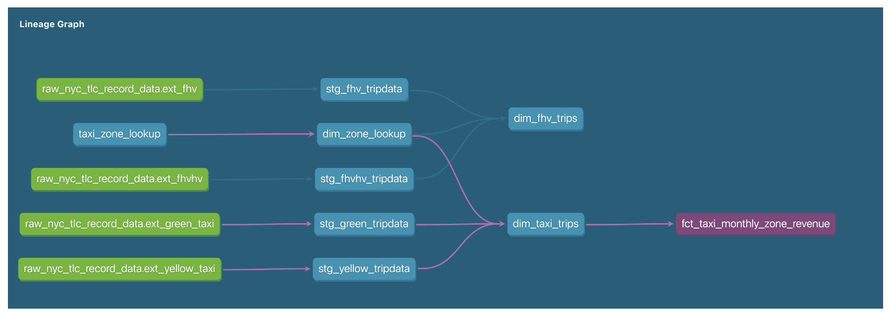

# Homework - Week 04

**01: Understanding dbt model resolution**


Provided you've got the following sources.yaml

```yaml
version: 2

sources:
  - name: raw_nyc_tripdata
    database: "{{ env_var('DBT_BIGQUERY_PROJECT', 'dtc_zoomcamp_2025') }}"
    schema:   "{{ env_var('DBT_BIGQUERY_SOURCE_DATASET', 'raw_nyc_tripdata') }}"
    tables:
      - name: ext_green_taxi
      - name: ext_yellow_taxi
```

with the following env variables setup where dbt runs:

````
export DBT_BIGQUERY_PROJECT=myproject
export DBT_BIGQUERY_DATASET=my_nyc_tripdata
````

What does this .sql model compile to?
>> select * from myproject.my_nyc_tripdata.ext_green_taxi


*Explanation*:

- From the yaml file: The database is set using the environment variable `DBT_BIGQUERY_PROJECT`, which defaults to `dtc_zoomcamp_2025`.
- From the yaml file: The schema is set using `DBT_BIGQUERY_SOURCE_DATASET`, which defaults to `raw_nyc_tripdata`.
- From the env variables: `DBT_BIGQUERY_PROJECT=myproject`, meaning the database will be `myproject`.
- From the env variables: `DBT_BIGQUERY_DATASET=my_nyc_tripdata` is not used here (it was not set in env variables, the name is slightly different). Instead, the schema should come from `DBT_BIGQUERY_SOURCE_DATASET`, which was not explicitly set in the exports. So, it falls back to the default: `raw_nyc_tripdata`.

---

**02: dbt Variables & Dynamic Models**

Say you have to modify the following dbt_model `(fct_recent_taxi_trips.sql)` to enable Analytics Engineers to dynamically control the date range.

- In development, you want to process only the last 7 days of trips
- In production, you need to process the last 30 days for analytics

````
select *
from {{ ref('fact_taxi_trips') }}
where pickup_datetime >= CURRENT_DATE - INTERVAL '30 days'
````
What would you change to accomplish that in a such way that command line arguments takes precedence over ENV_VARs, which takes precedence over DEFAULT value?

>> Update the WHERE clause to `pickup_datetime >= CURRENT_DATE - INTERVAL '{{ var("days_back", env_var("DAYS_BACK", "30")) }}' DAY`


*Explanation*:

- `var("days_back", ...)`: Looks for a command-line argument first.
- `env_var("DAYS_BACK", "30")`: If no command-line argument is found, it falls back to the DAYS_BACK environment variable.
- `"30"`: If neither is found, it defaults to 30 days.

----

**03: dbt Data Lineage and Execution**
Considering the data lineage below and that taxi_zone_lookup is the only materialization build (from a .csv seed file):



Select the option that does NOT apply for materializing `fct_taxi_monthly_zone_revenue`:

----

