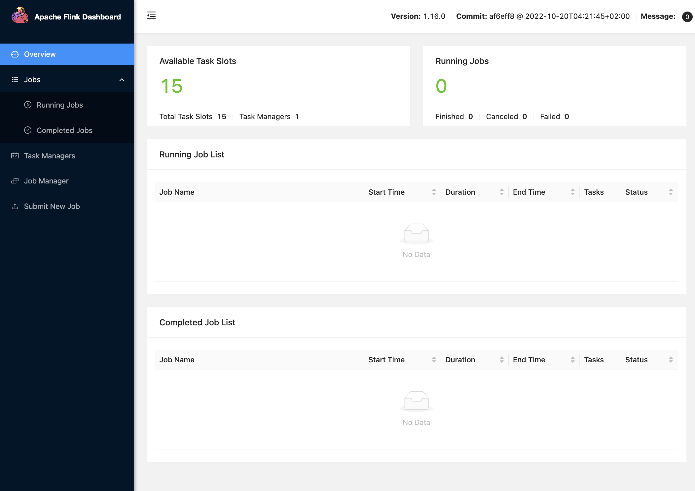
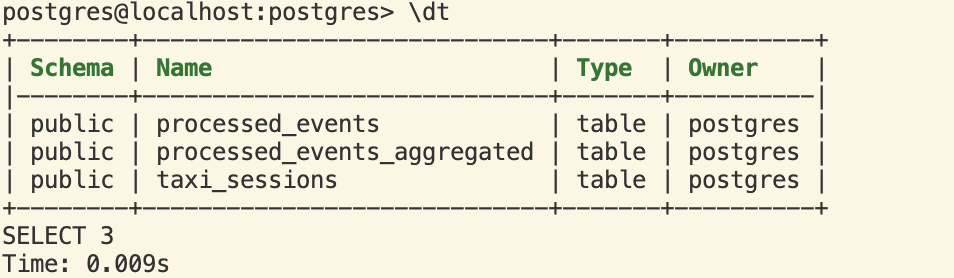
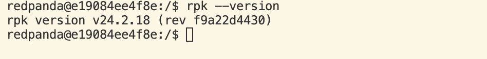
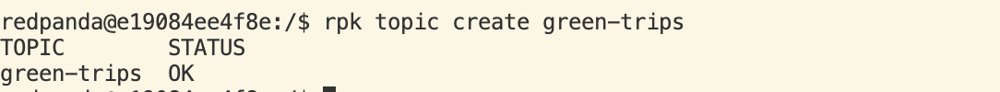
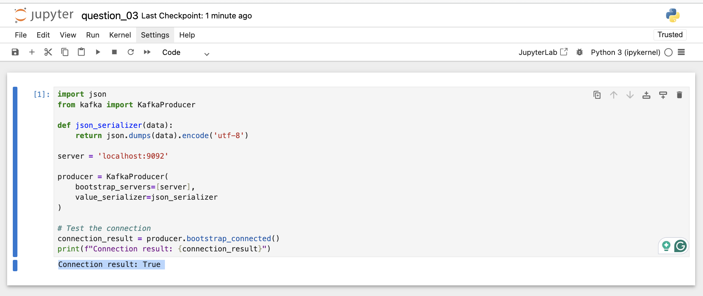
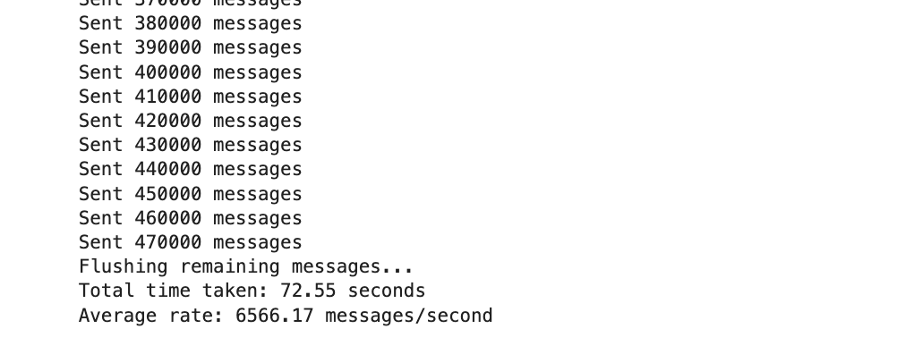
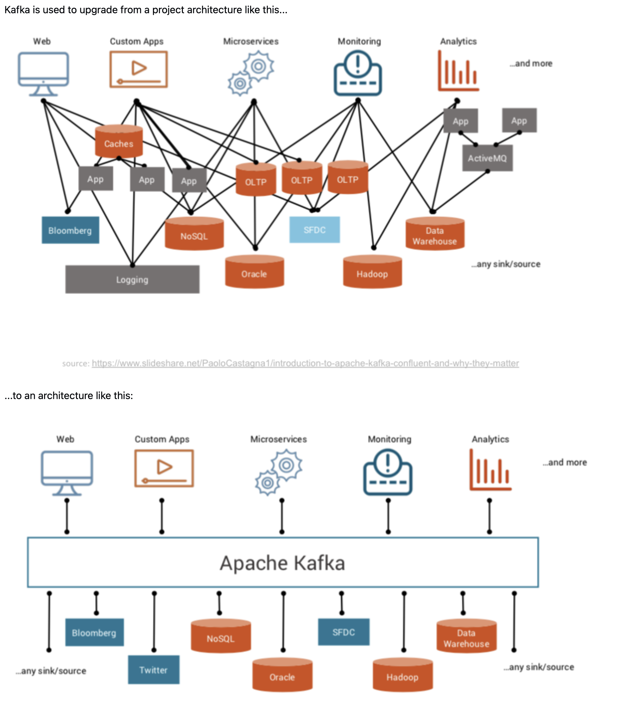
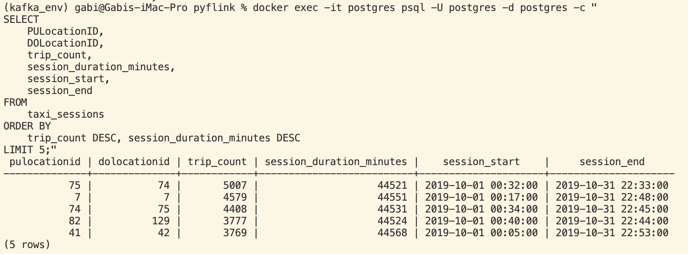

# Homework

In this homework, we're going to learn about streaming with PyFlink.

Instead of Kafka, we will use Red Panda, which is a drop-in
replacement for Kafka. It implements the same interface, 
so we can use the Kafka library for Python for communicating
with it, as well as use the Kafka connector in PyFlink.

For this homework we will be using the Taxi data:
- Green 2019-10 data from [here](https://github.com/DataTalksClub/nyc-tlc-data/releases/download/green/green_tripdata_2019-10.csv.gz)


## Setup

We need:

- Red Panda
- Flink Job Manager
- Flink Task Manager
- Postgres

It's the same setup as in the [pyflink module](../../../06-streaming/pyflink/), so go there and start docker-compose:

```bash
cd ../../../06-streaming/pyflink/
docker-compose up
```

(Add `-d` if you want to run in detached mode)

Visit http://localhost:8081 to see the Flink Job Manager

*You will see something like this:*



Connect to Postgres with pgcli, pg-admin, [DBeaver](https://dbeaver.io/) or any other tool.

The connection credentials are:

- Username `postgres`
- Password `postgres`
- Database `postgres`
- Host `localhost`
- Port `5432`

With pgcli, you'll need to run this to connect:

```bash
pgcli -h localhost -p 5432 -u postgres -d postgres
```

Run these query to create the Postgres landing zone for the first events and windows:

```sql 
CREATE TABLE processed_events (
    test_data INTEGER,
    event_timestamp TIMESTAMP
);

CREATE TABLE processed_events_aggregated (
    event_hour TIMESTAMP,
    test_data INTEGER,
    num_hits INTEGER 
);
```

*NOTE: At this step, you can already create the table for question 05*:

```sql
CREATE TABLE taxi_sessions (
    PULocationID INT,
    DOLocationID INT,
    session_start TIMESTAMP(3),
    session_end TIMESTAMP(3),
    trip_count BIGINT,
    session_duration_minutes DOUBLE PRECISION
);
```

*Check the tables at Postgres with `\dt`:*




*You can check if the tables have the right structure with:*

```
\d processed_events
\d processed_events_aggregated
\d taxi_sessions
```

## Question 1: Redpanda version

Now let's find out the version of redpandas.

For that, check the output of the command `rpk help` _inside the container_. The name of the container is `redpanda-1`.

Find out what you need to execute based on the `help` output.

What's the version, based on the output of the command you executed? (copy the entire version)
>> rpk version v24.2.18 (rev f9a22d4430)

*Explanation:*

1. First, inside the Redpand container shell:
`docker exec -it redpanda-1 bash`

2. Once inside the container, run `rpk help`

3. Look through the help output for information about how to check the version
    - It will be something like `rpk version` or `rpk --version`




-----

## Question 2. Creating a topic

Before we can send data to the redpanda server, we
need to create a topic. We do it also with the `rpk`
command we used previously for figuring out the version of 
redpandas.

Read the output of `help` and based on it, create a topic with name `green-trips`

What's the output of the command for creating a topic? Include the entire output in your answer.
>> The output is:

````
TOPIC        STATUS
green-trips  OK
````



---

## Question 3. Connecting to the Kafka server

We need to make sure we can connect to the server, so later we can send some data to its topics.

First, let's install the kafka connector (up to you if you
want to have a separate virtual environment for that)

**Let's create a virtual environment here before proceeding**
```bash
conda create -n kafka_env python=3.8
```

- Activate the env
```bash
conda activate kafka_env
```

- Install packages
```bash
pip install kafka-python
pip install jupyter
```


- Create a directory for our work at [kafta_test](../../06_streaming_processing/)
```bash
mkdir -p ~/kafka_test
cd ~/kafka_test
```

- Start a jupyter notebook `jupyter notebook` and run the following:

```python
import json

from kafka import KafkaProducer

def json_serializer(data):
    return json.dumps(data).encode('utf-8')

server = 'localhost:9092'

producer = KafkaProducer(
    bootstrap_servers=[server],
    value_serializer=json_serializer
)

producer.bootstrap_connected()
```

Provided that you can connect to the server, what's the output
of the last command?

>> Connection result: True



---

## Question 4: Sending the Trip Data

Now we need to send the data to the `green-trips` topic

Read the data, and keep only these columns:

* `'lpep_pickup_datetime',`
* `'lpep_dropoff_datetime',`
* `'PULocationID',`
* `'DOLocationID',`
* `'passenger_count',`
* `'trip_distance',`
* `'tip_amount'`

Now send all the data using this code:

```python
producer.send(topic_name, value=message)
```

For each row (`message`) in the dataset. In this case, `message`
is a dictionary.

After sending all the messages, flush the data:

```python
producer.flush()
```

Use `from time import time` to see the total time 

```python
from time import time

t0 = time()

# ... your code

t1 = time()
took = t1 - t0
```

How much time did it take to send the entire dataset and flush? 

>> 72.55 seconds




---


## Question 5: Build a Sessionization Window (2 points)

Now we have the data in the Kafka stream. It's time to process it.

* Copy `aggregation_job.py` and rename it to `session_job.py`
* Have it read from `green-trips` fixing the schema
* Use a [session window](https://nightlies.apache.org/flink/flink-docs-master/docs/dev/datastream/operators/windows/) with a gap of 5 minutes
* Use `lpep_dropoff_datetime` time as your watermark with a 5 second tolerance
* Which pickup and drop off locations have the longest unbroken streak of taxi trips?




